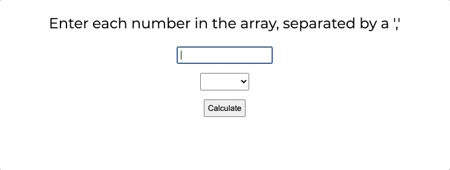
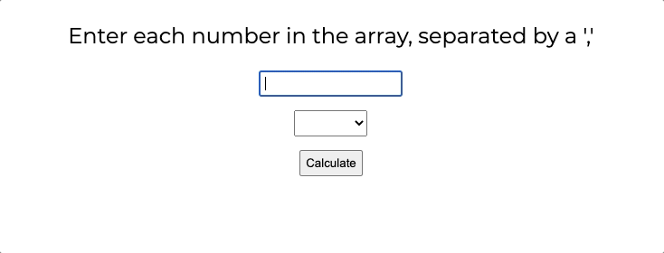

# React Forms

Using React, build a form that will dynamically take in text and perform a mathematical operation on it.

---

## Instructions

Build a React app containing:

- An input where the user can enter comma-separated number values in an array.
- A select input to choose between calculating the sum, the average, and the [mode](https://www.mathsisfun.com/definitions/mode.html) -- the most frequently occurring number.
- A "Calculate" button that, when pressed, puts the result of the selected operation on the input numbers on the screen.
  - If the numbers are invalid for some reason, display the exact message `Invalid input.`, keeping the punctuation.

You should leave the component structure as is.

### Examples

For example, if the text input contains `1,3,3,7` and the select is set to `sum`, clicking the button should print `14` to the screen.
Switching the select to `mode` and clicking the button again would replace that with `3`.

| input | operation | result         |
| ----- | --------- | -------------- |
| 1     | average   | 1              |
| 1     | mode      | 1              |
| 1     | sum       | 1              |
| 1,3,5 | average   | 3              |
| 1,3,5 | mode      | 1              |
| 1,3,5 | sum       | 9              |
|       | \*        | Invalid input. |
| apple | \*        | Invalid input. |
| 1,pie | \*        | Invalid input. |

### Bonus

There are additional challenges in place should you want to use them.

- If the input is valid, clear the input boxes after the "Calculate" button is clicked.
- If the input is invalid, _do not_ clear the input boxes after the "Calculate" button is clicked.
- Add a class of "error" to both the `input` and `select` elements if the input is invalid.
  - If the input is then changed so that it is valid, remove those classes the next time the "Calculate" button is clicked.

